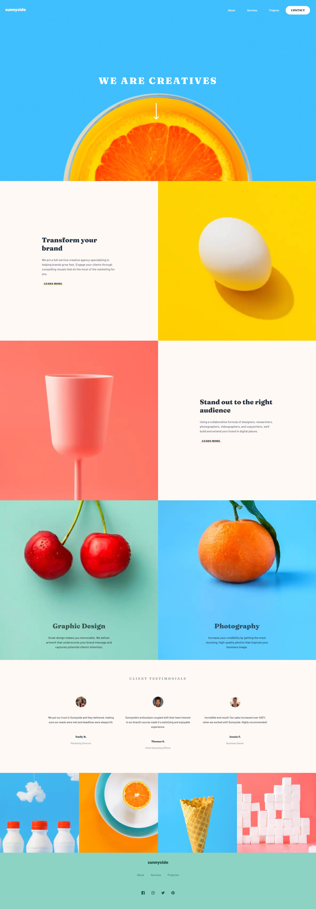

# Sunnyside agency landing page solution (Frontend Mentor challenge)

This is a solution to the [Sunnyside agency landing page challenge on Frontend Mentor](https://www.frontendmentor.io/challenges/sunnyside-agency-landing-page-7yVs3B6ef).

## Table of contents

- [Overview](#overview)
  - [The challenge](#the-challenge)
  - [Screenshot](#screenshot)
  - [Links](#links)
- [My process](#my-process)
  - [Built with](#built-with)
  - [What I learned](#what-i-learned)
  - [Continued development](#continued-development)
  - [Useful resources](#useful-resources)
- [Author](#author)

## Overview

### The challenge

Users should be able to:

- View the optimal layout for the site depending on their device's screen size
- See hover states for all interactive elements on the page

### Screenshot



### Links

- Solution URL: [Github](https://github.com/jan-wagenaar/sunny-side-v1)
- Live Site URL: [Demo @ jan-wagenaar.nl](https://jan-wagenaar.nl/work/gatsby-agency/)

## My process

### Built with

- Semantic HTML5 markup
- Flexbox
- CSS Grid
- [React](https://reactjs.org/) - JS library
- [Gatsby](https://www.gatsbyjs.com/) - React framework
- [Styled Components](https://styled-components.com/) - For styles

### What I learned

Two pieces of code I'm kinda proud of. 

```css
.gallery {
    position: relative;
    display: grid;
    grid-template-columns: 1fr 1fr;

    @media (min-width: ${props => props.theme.breakpoints.md}) {
    & {
        grid-template-columns: 1fr 1fr 1fr 1fr;
      }
}
```

```js
const NavBar = () => {
    const [isScrolled, setIsScrolled] = useState(false);
    const scrollOffset = 150;

    const throttledScrollHandler = React.useMemo(
        () => throttle(handleScroll, 50)
      , []);

    React.useEffect(() => {
        if(window.scrollY > scrollOffset) {
            setIsScrolled(true);
        }
        window.addEventListener("scroll", event => {
            throttledScrollHandler();
        })

        return () => {
            throttledScrollHandler.cancel();
            window.removeEventListener("scroll", event => {});
        }
    }, [throttledScrollHandler]);

    return (
        <>
            <Header isScrolled={isScrolled}>
        </>
    )
}
```

### Continued development

I had the opportunity to learn to work with Styled components, something I want to learn more about. Especially the scalability and architectural choices. For example, how to handle theming and general properties (spacing, colors etc.)

This project was also an exploration into functional components of React and their lifecycle management. This is something I would like myself to improve in.

### Useful resources

- [Gatsby docs](https://www.gatsbyjs.com/docs/) - Gatsby has a great documentation, which helped me a lot getting to know Gatsby (and React).
- [Throttling event listeners in React](https://dmitripavlutin.com/react-throttle-debounce/) - Amazing tutorial on how to throttle event listeners, something that confused me in how to do this in React (due to lifecycles)

## Author

- Website - [Jan-wagenaar.nl](https://www.jan-wagenaar.com)
- Frontend Mentor - [@jan-wagenaar](https://www.frontendmentor.io/profile/jan-wagenaar)
- LinkedIn - [Jan Wagenaar](https://www.linkedin.com/in/jan-wagenaar/)